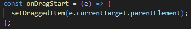

# My shopping list

This is a shopping list app where the user can search for an item, add it to their list, set the desired amount, check them off and delete them. And if the user is on a desktop, it has an additional feature which is to order them

## Built with

React
Vite

## How works?

When the user starts typing on the searcher, a debounce function is invoked to call the food API (https://api.frontendeval.com/fake/food/:food) and get the list of matches. Selecting an item and pressing the Enter key or clicking the Add button adds the item to the addedItems list only if the match list includes it and it has not already been added.

_src/components/Searcher_

_src/components/App_

The addedItems list is made so the checked items are in the last position and the unchecked before them, and whenever this list changes will be saved on localstorage

_src/components/App_

When setting a new amount to an item, the setNewAmmount function will get through the list and edit the item with its new amount

_src/components/App_

When deleting an item, the addedItems list will be filtered

_src/components/App_

The desktop order functionality works by drag and drop events, the draggable element is the drag icon.

_src/components/ShoppingItem_

On the drag start event, it will get the parent element of the icon (the item container to be reordered).

_src/components/App_

On the drag over event it will prevent the default behavior to allow the drop event

_src/components/App_

On the drop event, the sort functionality will only occur if there is a item dragged and the icon where it's being dropped on is draggable. And if so, it will get the index of the dragged item and the item where it will be dropped, delete its old position and set the new one based on these indexes

_src/components/App_

