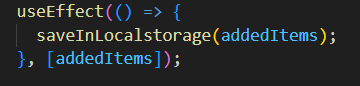

# My shopping list

Welcome to the Shopping List app! This application allows users to efficiently manage their shopping lists by searching for items, adding them with desired quantities, checking them off, and even ordering them on desktop.

## Built with

- React
- Vite

## How it Works

The app utilizes a debounce function in the Searcher component to interact with the food API (https://api.frontendeval.com/fake/food/:food) as the user types. The results are displayed in a dropdown and the item is added only if it matches the search and has not been added before.

_src/components/Searcher_

The addedItems list is made so the checked items are placed at the end and the unchecked before them. The list is stored in local storage to persist changes.

_src/components/App_

Desktop users can enjoy drag-and-drop functionality to reorder their shopping list. The draggable element is represented by a drag icon in the ShoppingItem component.

_src/components/ShoppingItem_

On drag start, the app captures the parent element of the drag icon (the item container to be reordered).

_src/components/App_

On drag over, the default behavior is prevented to allow the drop event.

Finally, on the drop event, the app checks if the item being dragged is allowed to be dropped, retrieves the indexes, and updates the list accordingly.

_src/components/App_

Feel free to use and enhance this shopping list app for your convenience!
